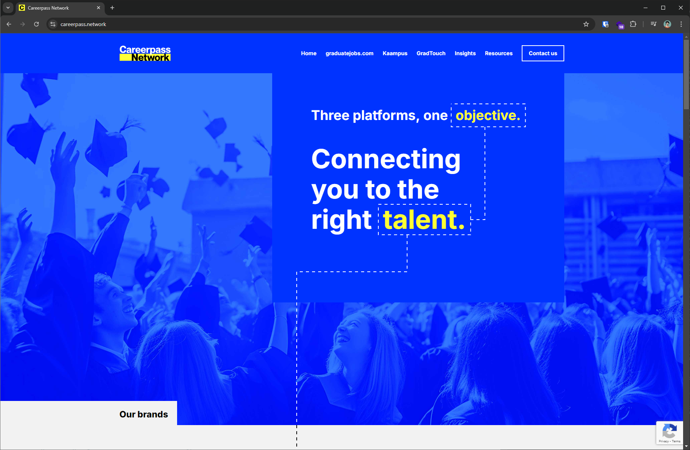
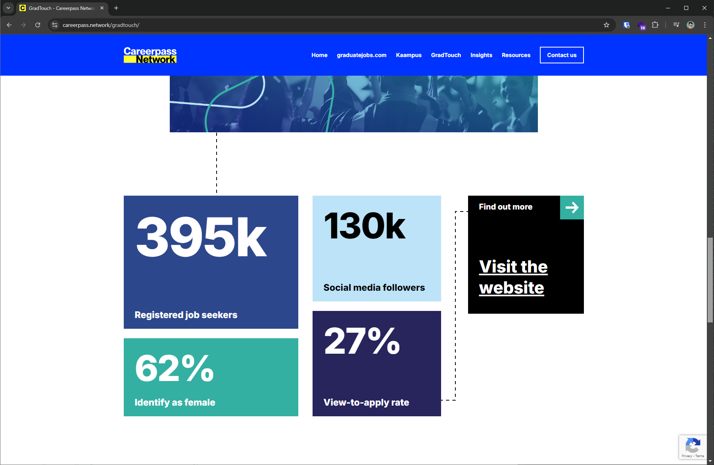
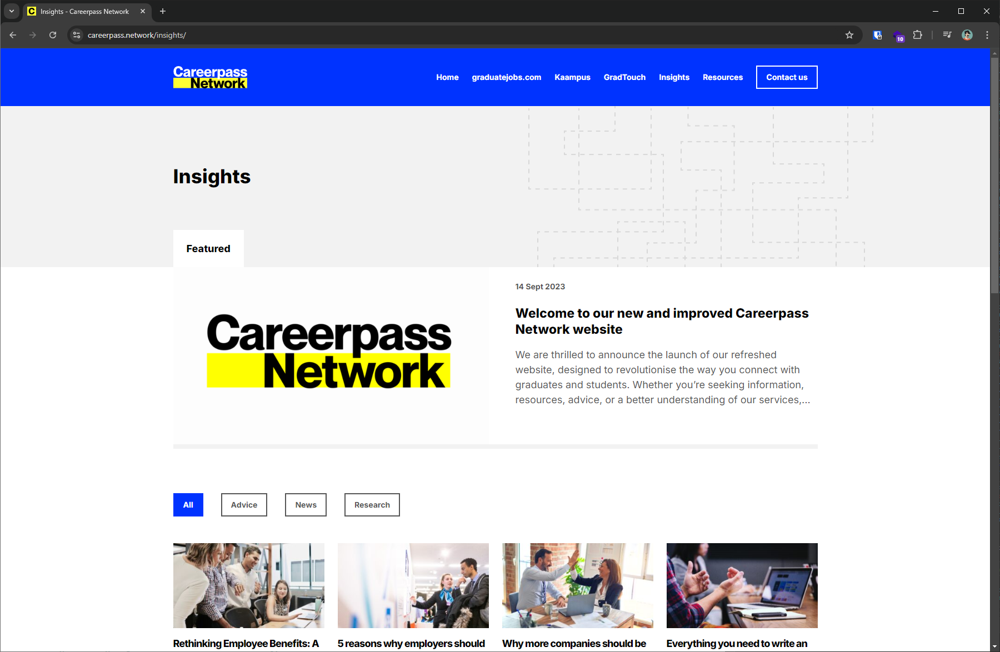

During my frontend development internship at [Unseen Group](https://unseen-group.com/), I led the development of a B2B website for Careerpass Network. The goal was to create a platform that showcased how businesses could leverage Careerpass Network's brands, such as [graduatejobs.com](https://www.graduate-jobs.com/), to advertise job openings. This project involved understanding stakeholder needs, designing, and developing a site that effectively communicated the company's value to potential business clients.

## Choosing the right tech

As the sole developer, I needed a solution that aligned with my skills but also those of the developers who would take over the project after my internship. Initially, I considered React but decided on AstroJS due to its simplicity and suitability for small websites. AstroJS offers a familiar component-based architecture for JavaScript developers and is ideal for building a JAMSTACK website with data-driven layouts and templating, which was a perfect fit for this project.

## Development problems and challenges

The project scope was expanded to include a news/blog system which would require some sort of CMS. While Wordpress was considered, my lack of familiarity with PHP led me to find an alternative solution. I looked into various content management systems, but none offered the ease of use that WordPress does for writing articles. To solve this, I managed to integrate WordPress as a headless CMS, by using a GraphQL plugin that could consume the WordPress data in AstroJS. This enabled the marketing team to create content in WordPress which they were familiar with, while seamlessly integrating it with the website's design.

Another challenge was incorporating Careerpass Network's updated branding, which featured a dynamic dotted-line design element. After exploring several approaches using JavaScript, I found success by creating SVG elements that could adapt responsively to the layout without distorting the design or line-thickness. This method ensured high-quality and consistent visuals across devices.

## Lessons learned

This project was a significant challenge that pushed me to understand the full end-to-end process of web development, from initial concept to final delivery. Despite the challenges, the project was a success, and both Unseen Group and Careerpass Network were delighted with the outcome.
