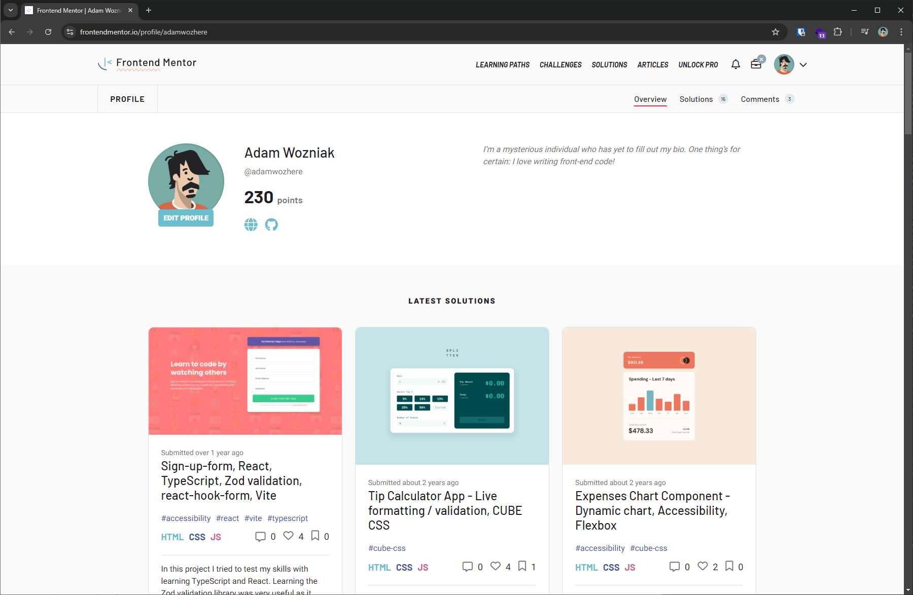
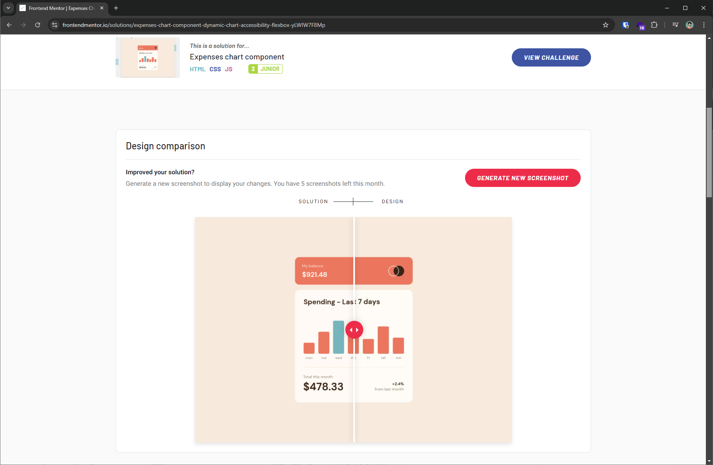

While starting on my journey with web development, I spent a lot of time with the fundamentals of HTML and CSS. Learning independently, I tested my skills by completing challenges on Frontend Mentor--you can see my solutions on my profile in the link above.

Frontend Mentor really tested my skills with HTML and CSS. While some of the smaller challenges may seem quite basic as they are often just a website component, they feature a lot of complexity and challenging thought process. It's a perfect way to practice skills in Semantic HTML and Accessibility, as well as CSS skills in matching the design file across desktop and mobile devices.

